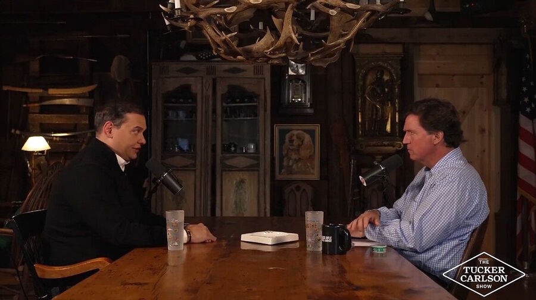
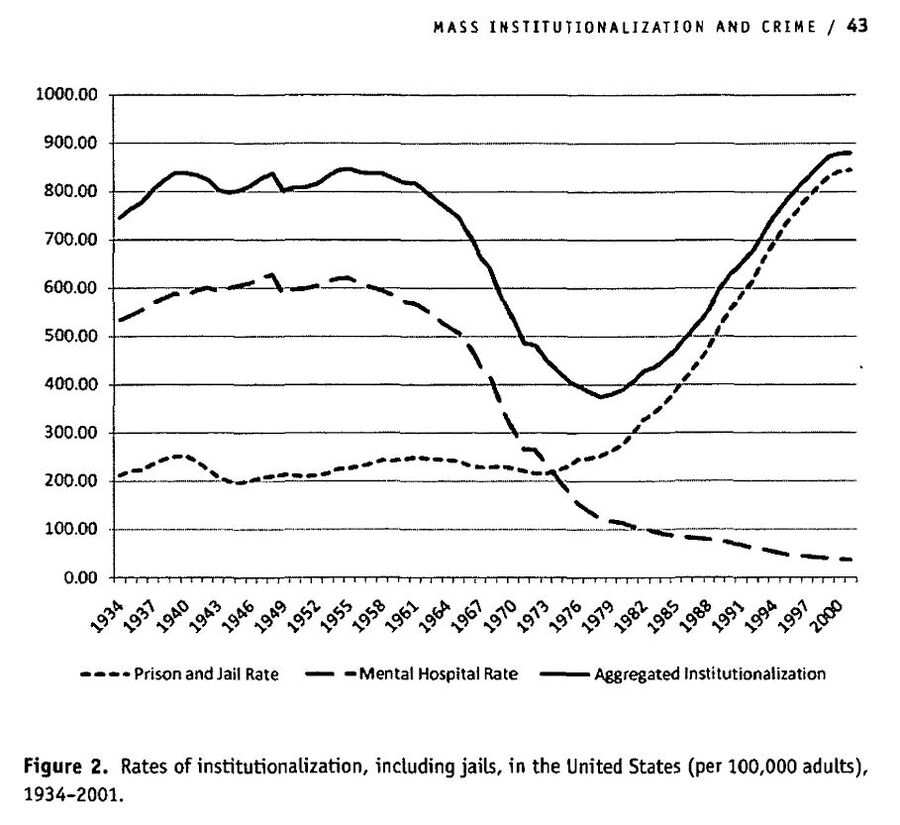
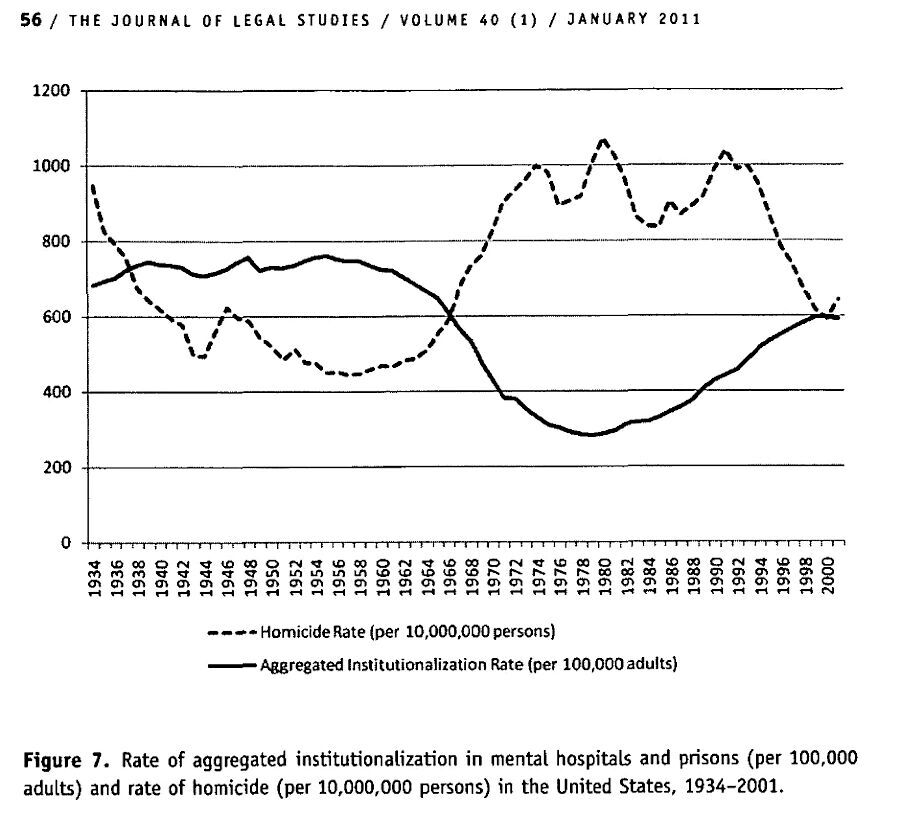
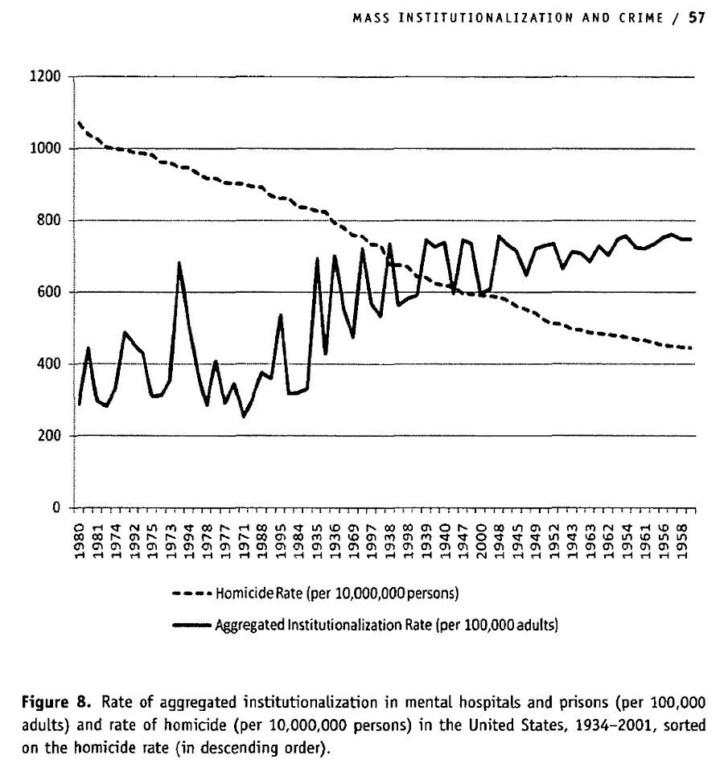

# Demokrasinin ölümcül kusuru ve bağışlama üzerine daha fazlası

**Harrison Koehli**

Politik Poneroloji

Pzt, 10 Kasım 2025, 22:38 (UTC)

*Tucker Carlson, George Santos'un hapisten çıkışının ardından 31 Ekim 2025'te kendisiyle röportaj yapıyor.*

**Tucker Carlson’ın George Santos ile yaptığı son röportajda sergilenen logokratik ilkeler**

Ücretli abonelere yönelik gerçekleştirdiğimiz son poneroloji buluşmamızda, Lobaczewski’nin *Logokrasi* adlı kitabında modern demokrasiye yönelttiği eleştirileri ele aldık. Bu eserde Lobaczewski, kendi bakış açısına göre demokrasinin başlıca kusurlarını ve bunların pratikte kaçınılmaz olarak nelere yol açtığını sıralar. Bu analiz, aşağıdaki ifadeyle doruk noktasına ulaşır:

> **“Demokratik bir ülkede seçime giren her aday, kamuoyunun bu kusurlarıyla yüzleşmek zorundadır ve bunları uygun vaatlerle tatmin edebilmelidir. Zihinsel kapasitesi ve karakteri yüksek olan kişilerin bunu yapması zordur; bu nedenle ya daha düşük sorumluluk duygusuna sahip adaylara yenilirler ya da bu tür taleplerden yılgınlığa kapılarak geri çekilirler. … İşte bu yüzden demokrasi, hitabeti güçlü ve insanlara yakın görünen, ancak nitelik açısından yeterli olmayan kişileri yasama ve liderlik konumlarına yükseltme yönünde sürekli bir eğilim taşır. Bu durum, devletin genelinde geçerli olduğu gibi, tek tek partiler içinde de benzer şekilde görülür; öyle ki parti liderleri bazen daha alt düzeydeki bazı aktivistlerden bile daha az donanımlı olabilir. Bu, doğal yasaya aykırıdır ve demokrasinin en büyük zayıflığını oluşturur.”**
> 

Başka bir deyişle, **kusurlu temelleri** — özellikle de **genel oy hakkı uygulamasını meşrulaştıran varsayımlar** — nedeniyle modern demokrasi, **Makyavelizm’i ve yetersizliği** seçip öne çıkarır ve sonuç olarak **şekli bozulmuş bir toplumsal yapı** üretir. En iyi adaylar ya bu oyuna girmek istemezler ya da (başlangıçta siyasete atılmaya karar verseler bile) siyasi kariyerlerinin çeşitli aşamalarında “elenirler”. Bu durum yalnızca siyasi partileri değil, **toplumları genel olarak ve tüm kurumlarını** etkiler. Örneğin, çoğu zaman **çalışanların yöneticilerinden ya da patronlarından daha zeki ve genel olarak daha yetkin** olduğunu görürsünüz; üstelik bu çalışanlar bunun **acı verici biçimde farkındadır**. (Bu, zayıf sosyo-mesleki uyumun ve bunun sonucunda ortaya çıkan “hasta” toplumun belirtilerinden biridir.)

Böyle bir durum, **makul derecede yüksek bir yetkinliğe sahip olan herkes için açıktır**. Yakın zamanda buna iyi bir örnekle karşılaştım. **Trump’ın kısa süre önce hapis cezasını hafiflettiği eski Cumhuriyetçi Kongre üyesi George Santos**, tahliyesinin ardından **Tucker Carlson**’a cezaevindeki deneyimlerini anlattı. [**Dinlemenizi tavsiye ederim](https://x.com/TuckerCarlson/status/1984304366640050414).**

<iframe width="800" height="500" src="[https://www.youtube.com/embed/AykhO46k6sQ](https://www.youtube.com/embed/AykhO46k6sQ)" title="George Santos: Being Tortured, Finding God, and Hearing of Charlie Kirk’s Murder From Behind Bars" frameborder="0" allow="accelerometer; autoplay; clipboard-write; encrypted-media; gyroscope; picture-in-picture; web-share" referrerpolicy="strict-origin-when-cross-origin" allowfullscreen></iframe>

Santos **eğlenceli bir konuşmacı** ve Amerikan hapishane sistemi hakkındaki gözlemleri, **Lobaczewski’nin *Logokrasi* adlı eserindeki eleştirileriyle uyumlu**. Örneğin, cezaevi personelinin hiyerarşisini anlatırken Santos, gardiyanların **%80’inin iyi, çalışkan insanlar** olduğunu; bunlardan **ikisinin ise olağanüstü derecede yetkin ve merhametli** olduğunu söylüyor. Elbette bu yalnızca çoğunluğu ifade ediyor. Buna karşılık, bazı infaz koruma memurları “**sırf bundan zevk aldıkları için hayatınızı çekilmez hâle getirmek ister; sizin acınızdan beslenir ve bundan haz alırlar**.” Ancak bu çoğunluk değildir. “**Bunlar çok az sayıdadır ve seçkin bir azınlığı oluşturur**.” Bu oran ister %10 ister %20 olsun, **sadistik eğilimlere sahip patolojik azınlığı** temsil eder — insan nüfusunun her yerinde bulunabilen ve **logokratik bir düzende herhangi bir toplumsal otorite konumundan dışlanması gereken** “**kalıcı yırtıcı kişilikler**”.

Ancak konu **cezaevi yönetimine** geldiğinde tablo farklıydı:

> “Gardiyanlarla (CO’larla) olumlu deneyimlerim oldu. Ancak yönetimle son derece kötü deneyimler yaşadım; yardımcı müdür Noble’dan, cezaevi müdürü Lynn Kelly’ye kadar. Kamp yöneticisine gelince — o da sonunda oradaki en yetkin kişi çıkıyor.”
> 

Bu, **modern demokrasinin pratikteki hâlidir**: **en az yetkin ve en kindar kişi** yönetici konumundadır; **en yetkin olan** (yine de idealin altında kalsa bile) ise **ast bir pozisyonda** bulunur. Bunun sonucu olarak söz konusu sistem bütünüyle **verimsiz ve işlevsiz** hâle gelir. Santos da kendi cezaevi özelinde bu yapının nasıl “işlediğini” sıralar: **fonların uygunsuz kullanımı**, **tesislerin ihmal edilmesi**, **sadizm** ve **bürokratik terörün** birleşimi.

Kısa süreli hapis cezasının bir sonucu olarak — bunun **yarısını tecritte** geçirmiştir (iddia edildiğine göre “kendi güvenliği için”, ki bunun doğru olmadığını söylüyor) — Santos artık **cezaevi reformunu savunmaktadır**; bu da **logokratik bir başka politika** örneğidir. Onun için bu deneyim son derece **olumsuz**, fakat aynı zamanda **dönüştürücü** olmuştur. Santos’un da işaret ettiği gibi, günümüzde cezaevlerinin rolüne dair hâkim görüş, onların **ıslah edici (rehabilite edici)** olması gerektiğidir. Ancak gerçekte **öyle değildirler**. Santos, cezaevi müdürüyle ilgili olarak şu nükteli yorumu yapar: “Birini ibret olsun diye cezalandırmamız gerekiyor; çünkü bu ülkede insanları rehabilite edeceksek, bu o kadının ya da onun gibilerin elinde olamaz.” Hapsetme meselesi etrafındaki **bitmeyen tartışma**, bunun **cezalandırıcı mı yoksa rehabilite edici mi** olması gerektiği üzerinedir. Eğer amaç **katı biçimde cezalandırmak** ise, cezaevi müdürü işini **son derece iyi** yapmaktadır. Santos, yaşadıklarının bu tartışmayı kendisi için netleştirdiğini söyler:

> **Santos:** “Ben hep iki [bakış açısını] dinlemişimdir — ve bunu yaptığım için kendimi suçlu hissediyorum. ‘Cezaevi reformuna ihtiyacımız var’ sözlerini her duyduğumda tepkim şu olurdu: Kimin umurunda? Hepsi suçlu. Kimin umurunda? Ölü olmadıkları için şükretsinler. Onlara elektrikli sandalyeyi vermeliyiz. Böyle aşırı şeyler söylerdim. Ama şimdi burada oturuyorum ve düşünüyorum ki: Vay canına, şimdi insanların ne demek istediğini anlıyorum. İnsanların acısını ve ıstırabını yok sayamayız.
**Carlson:** “Ve bu liberal bir pozisyon değil. Bu Hristiyan bir pozisyon. Yanlış yapanlar dâhil herkese onuruyla muamele etmek zorundasınız. Ayrıca, dürüst olacaksak, hepimiz bir şekilde yanlış yapan insanlarız.”
> 

Bu yalnızca **Hristiyan bir tutum** değildir; aynı zamanda **logokratik bir tutumdur**. Çünkü Lobaczewski’nin de belirttiği gibi, herhangi bir hukuk sistemi içinde **sanığın gerçek suçluluk düzeyine ilişkin her zaman belli bir şüphe ve belirsizlik payı** vardır. Ceza adaleti de bu gerçeği **kabul edecek şekilde** örgütlenmelidir. Serbest bırakıldıklarında **neredeyse kesin olarak yeniden suç işleyecek umutsuz suçlular** olduğu gibi, **en başta hiç hapiste olmaması gereken insanlar** da vardır. Buna rağmen, bu iki grup çoğu zaman **aynı şekilde muamele görür**. Bunun sonucunda cezaevleri **kriminojenik** hâle gelir: Logokratik hukuk [bölümüne](https://ponerology.substack.com/p/logocracy-chapter-11-logocratic-law) dair notlarımda yazdığım gibi, suçlular yalnızca cezaevi duvarları içinde suç işlemeye devam etmekle kalmaz, aynı zamanda **suçlu bir toplumsal yapı içinde sosyalleşerek** (örneğin çetelere katılarak) dışarı çıktıklarında **suç işlemekte daha da “usta” hâle gelirler**.

Yukarıda değinilen **Rodman’ın blog yazısında** şu ifadeler yer alır:

> “Zorlu bir incelemenin ardından, mevcut kanıtların büyük bölümü, bugün Amerika Birleşik Devletleri’nde cezaevlerinin insanları daha suçlu hâle getirdiğini göstermektedir. Daha fazla insanı hapsetmenin kısa vadede sağladığı suç azalması, uzun vadede ortadan kalkmaktadır.” Rodman, kapsamlı incelemesinde şu sonuca varır: “İnsanları hapse atmak, onları geçici olarak cezaevi duvarlarının dışında suç işlemekten alıkoysa da, tahliyeden sonra suçluluk düzeylerini artırma eğilimi taşır. Sonuç olarak, ‘suça karşı sert’ girişimler kısa vadede suçu azaltabilir, ancak uzun vadede bunu dengeleyen zararlar üretir.” Nagin, Cullen ve Jonson’a (2009) atıfla şöyle yazar:
“Cezaevi deneyimi aynı zamanda kriminojenik olabilir. İnsanları toplumdan yabancılaştırabilir ve toplumun kurallarına yönelik psikolojik bağlılıklarını zayıflatabilir. Aylarca bir arada kalarak birbirlerinden öğrenmelerine imkân tanıdığı için onları daha ‘iyi’ suçlular hâline getirebilir. Ayrıca, toplumsal etkileri cezaevlerinin içine kadar uzanan çetelere olan bağlılıklarını güçlendirebilir.”
> 

Suça yönelik çözüm, **kaçınılmaz ödünleşmelerden (trade-off’lardan)** oluşur. Örneğin **Bernard E. Harcourt**, kurumsallaştırma (institutionalization) ile cinayet oranları üzerine yaptığı çalışmada ilginç bir bulguya ulaşmıştır. Bu iki değişken **gerçekten de negatif korelasyon** göstermektedir (**daha fazla kurumsallaştırma, daha düşük cinayet oranları**), **ancak** bu ilişki **yalnızca toplam kurumsallaştırmayı** hesaba kattığımızda ortaya çıkmaktadır (yani **hapishaneler, cezaevleri ve akıl sağlığı kurumları birlikte** değerlendirildiğinde). Şu grafiklere bir bakmanız yeterli:

1960’lar ve 1970’ler, **akıl hastanelerindeki hastaların büyük ölçekli bir biçimde kurumlardan çıkarılmasına (deinstitüsyonelleşme)** sahne oldu. Bunu, **cinayet oranlarında keskin bir artış** izledi; ardından ise **1980’ler ve 1990’larda hapishane ve cezaevlerindeki insan sayısında bir başka keskin artış** yaşandı.

Eskiden **çok sayıda insanı akıl sağlığı kurumlarına** yerleştirirdik. **Şimdi ise onları hapishanelere ve cezaevlerine koyuyoruz.** Santos da buna dolaylı olarak değiniyor:

> “Bu durum sapkınca; verilen ruh sağlığı hizmetinin yetersizliği ortada. Altı psikolog olması gerekirken üç psikologları var. Bir tane bile psikiyatrist yok. Yani reçete yazabilen bir ruh sağlığı uzmanları yok. Bu yüzden psikologlar hastaları bir doktora yönlendirmek zorunda kalıyor; bu, ruh sağlığı standartları açısından akıl almaz bir şey—özellikle de söz konusu olan kişiler tutuklu olduğunda. Çünkü tahmin edin ne oluyor? Bunların büyük bir kısmı zaten ruh sağlığı sorunları yüzünden orada. Kötü muhakeme ve ruh sağlığı problemleri, insanların hapse girmesine yol açan asıl nedenler. Ama buna yönelik neredeyse hiçbir tedavi [sunulmuyor].”
> 

Santos cezaevine geldiğinde **ilaç kullanıyordu**. Onu **bir anda (cold turkey) ilaçtan kestiler** ve **antidepresanlar ile anksiyete ilaçlarından oluşan bir “kokteyl”** vermeye başladılar.

**Logokratik bir reform**, cezaevi nüfuslarında **büyük bir azalma** ve **akıl sağlığı kurumlarının yeniden açılmasını** öngörür; odak noktası, **rehabilite edilebilecek kişilerin iyileştirilmesi**, **ıslah şansı çok az ya da hiç olmayanlara ise hedefe yönelik müdahale** uygulanması olurdu.

Santos aynı zamanda **af yetkisinin (clemency)** gücüne dair bir örnektir; bu da bizi **Lobaczewski’nin bağışlama üzerine düşüncelerine** geri götürür. Lobaczewski bunu açıkça bu şekilde sınıflandırmasa da, **bağışlamanın çeşitli biçimleri** üzerine yorumlarda bulunur. **Resmî ve hukuki düzeyde**, antik **Sezaryen ayrıcalık** olarak bilinen **af yetkisi (clemency)** vardır. **Toplumsal ve kişilerarası düzeyde**, ister kişisel bir tercih olarak ister mahkemenin hukuki masumiyet kararı sonucunda olsun, **intikam almamayı tercih etmek anlamında bağışlama** bulunur. **Kişisel ve duygusal düzeyde** ise, size zarar vermiş bir kişiye yönelik **öfke ve kin duygularının sona ermesi** söz konusudur. Bu sonuncusuna ilişkin olarak, **Grok**, *Word Surgery* kitabındaki **günah keçisi sendromu** bölümüne dair şunları söylemiştir:

> **Bağışlama**, yalnızca mağdurun psikolojik olarak onarılması için değil, aynı zamanda deneyimini tanımlayan **travma ve kin döngüsünden özgürleşmenin bir yolu** olarak, iyileşmenin temel taşlarından biri olarak sunulur. **Yıllarca haksız suçlamalara, duygusal istismara ve psikolojik anormallik ithamlarına maruz kalmış günah keçisi** için bağışlama, annesi tarafından kendisine dayatılan **içselleştirilmiş suçluluk ve değersizlik anlatısından** onu kurtaran **dönüştürücü bir eylemdir**. Bağışlama, **annenin eylemlerini mazur görmek** anlamına gelmez; **kin ve acının duygusal kavrayışını serbest bırakmak** anlamına gelir. Bu süreç, günah keçisinin **benlik duygusunu yeniden kazanmasına** ve **“normal bir insan yaşamına” doğru ilerlemesine** imkân tanır.
> 
> 
> Metin, **bağışlamanın terapi sürecinde asla zorla dayatılmaması gerektiğini** vurgular. Bunun yerine terapistler, bağışlama kavramını **temkinli bir şekilde** ele alır ve onu **ileride ulaşılabilecek bir hedef** olarak bir tohum misali ekerler. Bu **kademeli yaklaşım**, günah keçisinin kendisine derin zararlar vermiş birini affetmeye karşı hissedebileceği **yoğun acı ve direnci** dikkate alır ve buna saygı gösterir.
> 
> Metin ayrıca, terapistlerin **yaşa uygun bir dil kullanarak**, annenin davranışlarının **günah keçisinin doğuştan gelen kusurlarından değil**, annenin **bozulmuş muhakeme yetisi ve zayıf duygusal kontrolünden** kaynaklandığını aktarması gerektiğini açıklar. Bu çerçeve, bağışlamanın **kişinin kendine ihanet etmesi** gibi algılanmasını önler ve onu, **annenin sınırlılıklarının kabulü** olarak görmeyi mümkün kılar.
> 
> Günah keçisinin bağışlamaya verdiği **ilk tepki**, çoğu zaman **öfke ya da inanmazlık** olabilir; çünkü bu fikir, yaşanmış **adaletsizlik deneyimiyle çelişiyor gibi görünür**. Metin, **erken ya da zorla gündeme getirilen bağışlama tartışmalarının**, özellikle de günah keçisi kendi acısını tam olarak işlemeden annesini aklamaya zorlandığını hissederse, **ihanet duygusunu daha da derinleştirebileceği** konusunda uyarır. *(Bu nedenle “bağışlama söylemi” çoğu zaman bu kadar uygunsuz ve duyarsızdır.)*
> 
> Burada tanımlanan anlamıyla bağışlama, **anneyle barışmaktan çok**, günah keçisini travmasının **ahlaki ve psikolojik yükünden özgürleştirmekle** ilgilidir. Metin, annenin davranışlarına yönelik **ahlâkçı yorumların** (örneğin onu “kötü” olarak etiketlemenin) yerine, **ponerolojiye dayalı nedensel bir anlayışın** konmasını savunur; bu yaklaşım, annenin eylemlerini **patolojik bir durumun belirtileri** olarak görür. Bu bakış açısı, günah keçisinin **zalimliği mazur görüyormuş gibi hissetmeden** bağışlayabilmesine imkân tanır.
> 

Josh Slocum ile yaptığım konuşmada da söylediğim gibi, **gündelik toplumsal etkileşimlerde insanlar sağlıksız bir düzeye varacak kadar bağışlamaz olabilirler**. İlk kırgınlık çok küçük bir şey olabilir ya da bağışlamayan kişi, iddia edilen failin suçluluğuna **yanlış biçimde kesin olarak inanmış** olabilir. Bu tür durumlarda, **daha üst düzey bir kurumun müdahalesi** gerekebilir. Bu kurum bazen **ailenin kendisi** olur ve ne yapılması gerektiğini belirler. Bazen **bir mahkeme kararı** devreye girer. Ya da her şeyin başarısız olduğu durumlarda — **Santos örneğinde olduğu gibi** — **devlet başkanının resmî bir af ve ceza indirimi** ilan etmesi gerekebilir. **Santos’un durumunda izlenmesi gereken doğru yol buydu.**

**Lobaczewski’nin logokratik ilkelerine göre hukuki bağışlama**, belirli bir suçun **psikolojik dinamiklerini** de hesaba katmalıdır. Buna örnek olarak **764** gibi bir grubu ele alalım (bkz. **Bx Writes**’ın çalışmaları). Bx, bu konuyla ilgili bir **X (Twitter) dizisi** yazmıştır; [dizi](https://x.com/bx_on_x/status/1984090967515734059) şu şekilde başlar:

> Arizona’dan **21 yaşındaki Baron Martin**, namıdiğer **“Convict”**, **çocukların cinsel istismarı**, **siber taciz**, **hayvanlara yönelik vahşet (animal crushing)**, **cinayet komplosu**, **elektronik dolandırıcılık** ve **teröristlere maddi destek sağlama** dâhil olmak üzere **29 AĞIR SUÇLAMAYLA** iddianameye konu edildi. İnanılır gibi değil ama hâlâ bu ağın **ciddiyetini ve uç düzeydeki sapkınlığını** küçümsemeye çalışan epey insan var. **Terör suçlamaları** iyi bir başlangıç! Martin’in **39 sayfalık iddianamesinden** bazı ekran görüntülerini bu dizide paylaşacağım; çünkü **ebeveynlerin burada neyle karşı karşıya olduğumuzu anlaması** önemli. **(TETİKLEYİCİ UYARI!)** Çocuk ve hayvan istismarına dair içeriklere hassassanız, **lütfen diziyi okumamayı düşünün**.
> 

**764**, sadistik psikopatlar ile **kendilerine zarar vermeleri, hayvanlara ve diğer insanlara zarar vermeleri için yönlendirilen (grooming’e maruz kalan) çocuklardan** oluşan **merkeziyetsiz bir kolektiftir**. Martin, **“önceden yeme bozukluğu ve kendine zarar verme eğilimleri bulunan çocukların çevrimiçi ortamda nasıl hedef alınacağına”** dair materyaller dağıtmıştır. Ayrıca, **diğer 764 üyelerine**, çocukları **aşağılayarak**, **şiddet içeren görüntülere (gore)**, **çocuk istismarı materyallerine** ve **hayvan istismarı içeriklerine maruz bırakarak**, onları **aşırı ve şiddet içeren eylemlere karşı duyarsızlaştırmaya** yönelik **grooming taktikleri** kullanmayı **öğrettiği iddia edilmektedir**; bunun da çocukları **kendilerine ve başkalarına zarar vermeye teşvik etmeye**, hatta **intihara kadar tırmandırmaya** varan bir sürece dönüştüğü belirtilmektedir.

> İddianameye göre Martin, 13 yaşındaki bir kızı korkunç bir şekilde istismar ederek, vücuduna gamalı haçlar, şeytani semboller ve "Mahkum" yazıları kazımaya zorlamış ve bu da kalıcı bir şekil bozukluğuna yol açmıştır. Martin ayrıca kızın ev adresini ve okulunun yerini bulmak için onu sosyal olarak manipüle etmiş ve itaat etmemesi halinde onu ve ailesini öldürmek ve tecavüz etmekle tehdit etmiştir. Sonunda istismarını daha da ileri götürerek kızdan aşırı dozda hap almasını istemiştir.

Martin'in ayrıca genç bir kızı, hamsterını ezerek öldürmeye ve köpeğine yedirmeye zorladığı, ardından videoyu kullanarak kızı taciz ettiği ve başını belaya sokmakla tehdit ettiği iddia edilmektedir.
> 

Bir **psikopat** bir suç işlerse — örneğin **hayvan istismarı** — ve **psikopatik yöntemlerle bir çocuğu aynı suçu işlemeye yönlendirirse**, bu iki kişi **aynı hukuki sonuçlarla mı** karşılaşmalıdır? **Lobaczewski böyle düşünmezdi.** Ona göre, **birincisinin** daha fazla suç işlemesinin **önlenmesi** gerekirken, **ikincisinin** ise **etkili psikoterapi yoluyla rehabilite edilmesi** gerekir. Böyle bir terapi, çocuğun **normalde asla işlemeyeceği suçları işlemesine etki eden psikolojik dinamiklerin** farkına varmasını sağlar. Lobaczewski’nin [başka yerlerde de belirttiği gibi](https://ponerology.substack.com/p/logocracy-chapter-19-the-judiciary), **bağışlama ya da af (clemency)**, bazı kişiler üzerinde **bizzat rehabilite edici bir etki** yaratır. **Santos**, bana göre, bu kişilerden biridir.

Bugün durum **neredeyse tamamen tersine dönmüş** durumdadır. **En ağır suçlular**, “**akıl hastalığı**” gerekçesiyle **erken salıverilmekte** ve çoğu zaman **çok kısa sürede yeniden suç işlemektedir**. Oysa **kişilik işlev bozukluğu**, sonuçları belirlerken **hafifletici değil**, **ağırlaştırıcı bir unsur** olarak değerlendirilmelidir.

Yukarıda ele alınan tüm fikirlerin ardındaki **yol gösterici ilke basittir**: **İnsanlar psikolojik açıdan son derece çeşitlidir** ve bu farklılıklar **tüm kurumlarımızı şekillendirmelidir**. Mevcut durumda **hiçbir sistem**, bu farklılıkları yeterince tanımamakta ve kurumlarının oluşumu ile işleyişinde bunları gerçek anlamda hesaba katmamaktadır. Bazı açılardan **antik sistemler**, zaman zaman daha iyi bir iş çıkarmıştı. **Lobaczewski’nin Logokrasi ile amacı**, bu fikri **gerçekten ciddiye alan** bir sistem önermekteydi.